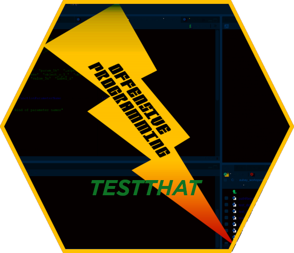

```{r setup, include = FALSE}
knitr::opts_chunk$set(
  collapse = TRUE,
  comment = "#>"
)
source('common-style.R')
```



# name [awesome-asterion-upsilon] package-version [1.1.20] timestamp [2021-10-05 20:29:24]

1. CRAN information on obsolescence of lubridate - need to remove dependency.
1. lubridate::date() was not used but speficied in `r citefile("DESCRIPTION")` and `r citefile("NAMESPACE")`
1. Test, Duration: `r citefigure('0.7s')`, OK: `r citefigure('21')`
1. `r citeexec('R CMD check')`, Duration: `r citefigure('21.5s')`, 0 errors ✓ | 0 warnings ✓ | 0 notes ✓
1. `r citeval('Commercial software release management')`
1. `r citefolder('vignette')` content update
1. `r citeop("git")` alignment

# name [awesome-asterion-tau] package-version [1.1.19] timestamp [2020-11-09 20:13:02]

1. enforced R 4.0
1. Test, Duration: `r citefigure('0.6s')`, OK: `r citefigure('21')`
1. `r citeexec('R CMD check')`, Duration: `r citefigure('23.9s')`, 0 errors ✓ | 0 warnings ✓ | 0 notes ✓
1. `r citeval('Commercial software release management')`
1. `r citefolder('vignette')` content update
1. `r citeop("git")` alignment


# 1.1.18 - awesome-asterion-sigma - 2020-05-04

1. Test, Duration: `r citefigure('0.6s')`, OK: `r citefigure('21')`
1. `r citeexec('R CMD check')`, Duration: `r citefigure('23.2s')`, 0 errors ✓ | 1 warnings ✓ | 0 notes ✓
1. `r citeval('Commercial software release management')`
1. `r citefolder('vignette')` structure update
1. `r citefolder('vignette')` content update


# 1.1.17 - April, 22nd 2020

1. updated all documentations
1. Upgraded and updated vignette
1. test, Duration: `r citefigure('0.6s')`, OK: `r citefigure('21')`
1. test, Duration: `r citefigure('24.1s')`, 0 errors ✓ | 0 warnings ✓ | 0 notes ✓

# 1.1.9 - January 2020

Main improvements are 

1. `r citefun("packageFunctionsInformation")` renamed to `r citefun("opTestthatInformation")`
1. `r citefun("opTestthatInformation")` verified and upgraded
1. completed manual pages - 4 manual pages 
1. enhanced manual pages documentation: review of all contents and corrections
1. upgraded vignette - 1 vignette
1. completed test panel - 5 test files - 20 tests
1. Worked on test coverage to reach level higher than 99%
1. Timing for tests 1s, checks 25s

# 1.1.6

Main improvements are 

1. corrected erroneous write out of tempdir folder
1. completed unit tests
1. enforced higher code coverage (up to 99.40%)
1. clean up package dependencies. 


This release replaces fully olders ones, that are now considered obsoletes. Keep the pace, and 
upgrade your packages if you do not use this version or a higher one!

